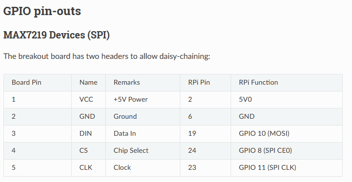
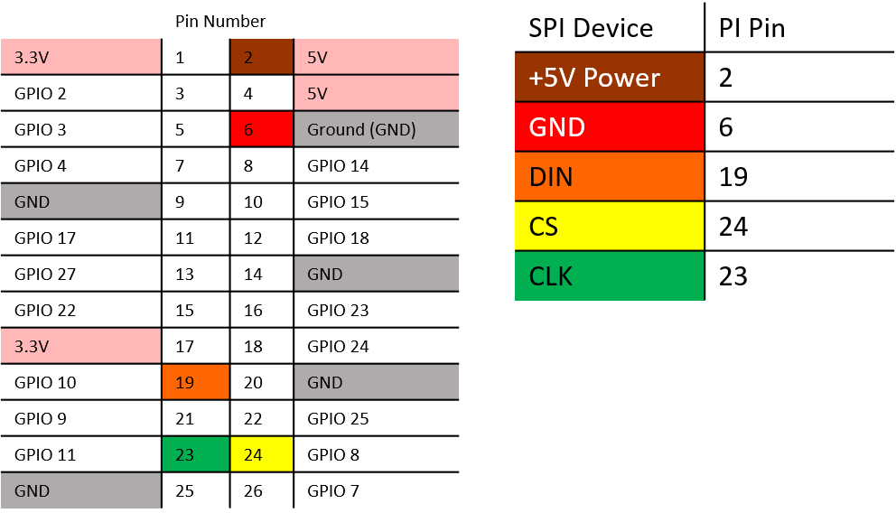

# darkroom

This is my code for a darkroom timer using:

* RaspberryPi
* IoT Relay (power switch)
* 8x8 x4 LED Matrix
* USB Numpad

## Hardware setup

The SPI and IoT device should be connected before the software is installed

### LED Matrix wiring 




### IoT Relay wiring

The IOT device should be connected to GPIO 18 (aka PI Pin number 12). Check your
relay device if uses ACTIVE HIGH mode or not and set ACTIVE_MODE_HIGH correctly.

## Installing

* [Enable SPI](https://luma-led-matrix.readthedocs.io/en/latest/install.html#max7219-devices) launch `sudo raspi-config` and into `5 Interface Options` set `P4 SPI` to `Yes` 
* Launch `sudo raspi-config` and into `3 Boot Options` then `B1 Desktop / CLI` and set `B2 Console Autologin`
* Add user to proper groups `sudo usermod -a -G spi,gpio pi`
* Install luma pre-reqs `sudo apt update && sudo apt install -y build-essential python3-dev python3-pip python3-venv libfreetype6-dev libjpeg-dev libopenjp2-7 libtiff5 git`
* Checkout darkroom `cd ~ && git clone https://github.com/cdgriffith/darkroom && cd darkroom`    
* Create a virtual env `python3 -m venv venv`
* Activate env `source venv/bin/activate`
* Update pip `python -m pip install --upgrade --ignore-installed pip setuptools`
* Install requirements `pip install -r requirements.txt`
* Test the program `python -m darkroom`
* Add it to bashrc `echo "PYTHONPATH=/home/pi/darkroom /home/pi/darkroom/venv/bin/python -m darkroom" > ~/.bashrc`

Once added to the bashrc file, it will automatically launch when the user logs in. This will "take over" the console, 
even on SSH connections, so remember if you need to switch back to console to hit E or Ctrl+C first. 

## Key controls

```
*      Start key capture (to input time via number keys, hit "*" again to accept)
+      Add a tenth of a second
-      Remove a tenth of a second
/      "Focus" - Turn the enlarger on
ENTER  "Print" - Enlarger on, timer counts down to zero then turns the enlarger back off
e      Pressing E or Ctrl+C Will exit the program 
```

## Configuration

It is possible to customize a few things with environment variables

* X_OFFSET (default 0) 
* Y_OFFSET (default -2)
* BLOCK_DIR (default -90)
* ENLARGER_PIN = (default 18)
* STARTUP_MESSAGE = (default 'LOVE U')
* FONT_FILE = (default "darkroom/fonts/scoreboard.ttf")
* ACTIVE_MODE_HIGH = (default True)


## License

This is MIT Licensed, view the LICENSE file for details.

This is using the Free for personal use Scoreboard font available at https://www.ffonts.net/Score-Board.font
